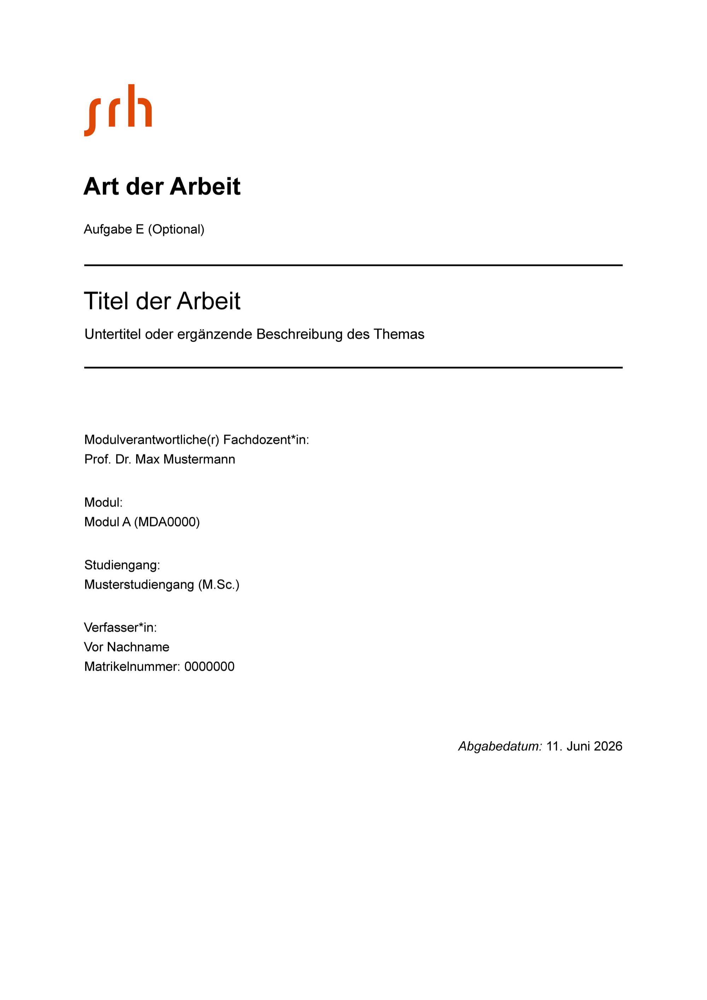
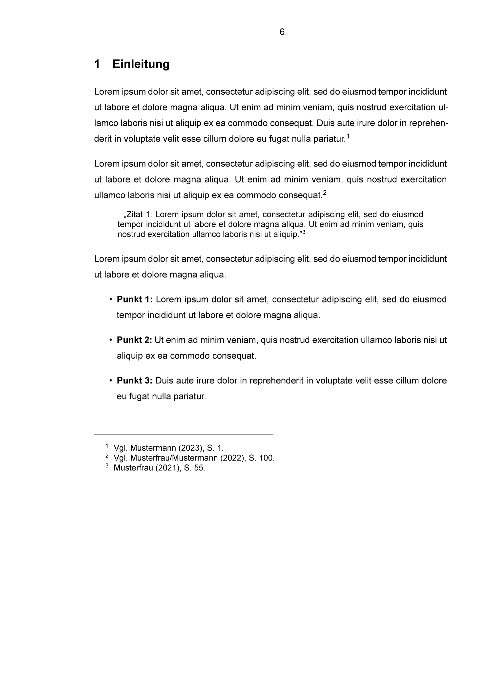
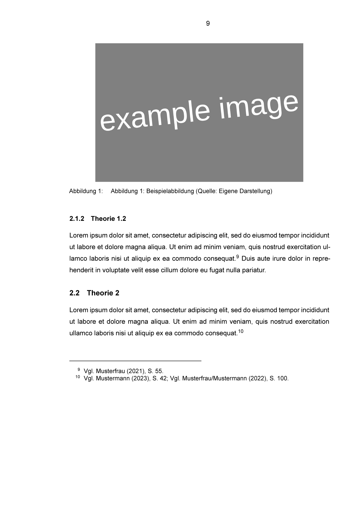
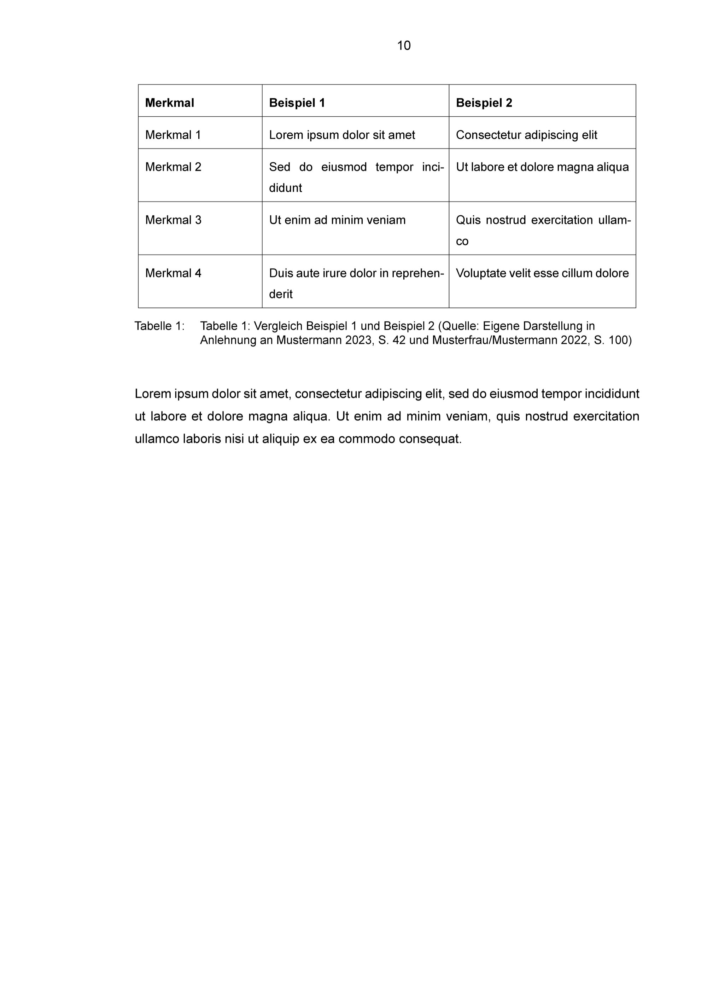

# SRH Hochschule – LaTeX Template

Ein LaTeX-Template für Haus- und Abschlussarbeiten an der SRH Hochschule. Das Template verwendet LuaLaTeX mit Biber für das Literaturverzeichnis.

---

## Vorschau

<table>
  <tr>
    <td></td>
    <td></td>
    <td></td>
    <td></td>
    <td></td>
  </tr>
  <tr>
    <td align="center"><sub>Titelseite</sub></td>
    <td align="center"><sub>Einleitung</sub></td>
    <td align="center"><sub>Abbildung</sub></td>
    <td align="center"><sub>Tabelle</sub></td>
    <td align="center"><sub>Literaturverzeichnis</sub></td>
  </tr>
</table>

---

## Projektstruktur

```
srh-template/
├── main.tex                        # Hauptdatei – Einstiegspunkt zum Kompilieren
├── abstract.tex                    # Kurzfassung / Abstract
├── toc.tex                         # Inhaltsverzeichnis
├── acronyms.tex                    # Abkürzungsverzeichnis
├── listoffigures.tex               # Abbildungsverzeichnis
├── listoftables.tex                # Tabellenverzeichnis
├── anlagenverzeichnis.tex          # Anlagenverzeichnis
├── bib.tex                         # Literaturverzeichnis (Ausgabe)
├── appendix.tex                    # Anhang-Wrapper
├── contents/                       # Kapitel der Arbeit
│   ├── 01-einleitung.tex
│   ├── 02-theorie.tex
│   ├── 03-methode.tex
│   ├── 04-ergebnisse.tex
│   └── 05-diskussion.tex
├── appendices/                     # Einzelne Anhang-Dateien
│   └── appendix_a.tex
├── bibliographies/resources/       # BibLaTeX-Quelldateien
│   ├── bibresources.tex            # Wrapper: bindet die .bib-Dateien ein
│   └── literatur.bib               # Eigentliche Literaturdatenbank
├── settings/                       # Layout- und Paket-Konfiguration
│   ├── packages.tex                # Alle \usepackage-Einbindungen
│   ├── page.tex                    # Seitenformatierung
│   └── titlepage.tex               # Titelseite
└── images/                         # Bilder und Grafiken
    ├── srh.png                     # SRH-Logo (Titelseite)
    ├── example_image.png           # Beispielbild für die Kapitel
    └── preview/                    # README-Vorschau-PNGs
```

---

## Voraussetzungen

### macOS

1. [Homebrew](https://brew.sh/) installieren
2. MacTeX installieren:
   ```bash
   brew install --cask mactex
   ```

### Windows

Leider nicht erprobt... Bisher nur auf MacOS getestet.

---

## Template verwenden

### 1. Repository klonen

```bash
git clone <repository-url>
cd srh-template
```

### 2. Titelseite anpassen

Datei `settings/titlepage.tex` öffnen und die Platzhalter ersetzen:

```latex
\textsc{\huge \textbf{Art der Arbeit}} % z.B. Hausarbeit, Masterarbeit
Aufgabe E (Optional) % Aufgabenbezeichnung oder leer lassen

{ \huge Titel der Arbeit} % Eigenen Titel eintragen
{ \large Untertitel ...} % Untertitel oder leer lassen

Prof. Dr. Max Mustermann % Name der Dozent*in
Modul A (MDA0000) % Modulname und -nummer
Musterstudiengang (M.Sc.) % Studiengang
Vor Nachname % Eigener Name
Matrikelnummer: 0000000 % Eigene Matrikelnummer
```

### 3. Kapitel befüllen

Die Kapitel befinden sich im Ordner `contents/`. Jede Datei entspricht einem Kapitel:

- `01-einleitung.tex` – Einleitung
- `02-theorie.tex` – Theoretischer Hintergrund
- `03-methode.tex` – Methodik
- `04-ergebnisse.tex` – Ergebnisse
- `05-diskussion.tex` – Diskussion und Fazit

Weitere Kapitel können nach demselben Schema angelegt und in `main.tex` per `\input{}` eingebunden werden.

### 4. Literatur verwalten

Quellen werden im BibLaTeX-Format in `bibliographies/resources/literatur.bib` gepflegt. Die Datei `bibresources.tex` ist nur ein Wrapper, der die `.bib`-Dateien per `\addbibresource{}` einbindet — dort können bei Bedarf weitere kapitelweise `.bib`-Dateien hinzugefügt werden.

**Wichtig:** Keine Unterstriche in Zitierschlüsseln verwenden – das verursacht Build-Probleme mit Prettier:

```bibtex
% FALSCH
@book{hammer_reengineering_1990, ...}

% RICHTIG
@book{hammerreengineering1990, ...}
% ODER
@book{hammer:reengineering:1990, ...}
```

Zitieren im Text:

```latex
\autocite{hammer:reengineering:1990} % Fußnotenzitat (Standard)
\textcite{hammer:reengineering:1990} % Textzitat: "Hammer (1990) zeigt..."
```

### 5. Anhang

Der Anhang ist in `appendix.tex` eingebunden. Einzelne Anhang-Dateien liegen unter `appendices/`. Wenn kein Anhang benötigt wird, die entsprechenden `\input{}`-Zeilen in `main.tex` auskommentieren:

```latex
% \input{anlagenverzeichnis.tex}   % auskommentieren wenn kein Anhang benötigt
% \input{appendix.tex}             % auskommentieren wenn kein Anhang benötigt
```

---

## Installation in VSCode

### 1. VSCode-Erweiterungen installieren

- [LaTeX Workshop](https://marketplace.visualstudio.com/items?itemName=James-Yu.latex-workshop)
- (Optional) [Prettier](https://marketplace.visualstudio.com/items?itemName=esbenp.prettier-vscode)

### 2. VSCode-Einstellungen konfigurieren

`CMD+Shift+P` (macOS) bzw. `Ctrl+Shift+P` (Windows) → **"Open User Settings (JSON)"** → folgende Konfiguration einfügen:

```json
"latex-workshop.latex.tools": [
  {
    "name": "lualatex",
    "command": "lualatex",
    "args": [
      "-synctex=1",
      "-interaction=nonstopmode",
      "-file-line-error",
      "-pdf",
      "%DOC%"
    ]
  },
  {
    "name": "latexmk",
    "command": "latexmk",
    "args": [
      "-synctex=1",
      "-interaction=nonstopmode",
      "-file-line-error",
      "-pdf",
      "-outdir=%OUTDIR%",
      "%DOC%"
    ]
  },
  {
    "name": "bibtex",
    "command": "bibtex",
    "args": ["%DOCFILE%"]
  },
  {
    "name": "biber",
    "command": "biber",
    "args": ["%DOCFILE%"]
  }
],
"latex-workshop.latex.recipes": [
  {
    "name": "lualatex->biber->lualatex",
    "tools": ["lualatex", "biber", "lualatex"]
  }
],
// Overfull/Underfull Hbox-Warnungen im Problems-Panel ausblenden
"latex-workshop.message.badbox.show": false,
// Biblatex-Backend für korrekte Zitatvorschläge (verhindert wellige Linien)
"latex-workshop.intellisense.citation.backend": "biblatex",
// Einrückung im BibTeX-Editor auf vier Leerzeichen setzen
"latex-workshop.bibtex-format.tab": "4 spaces",
// PDF nach jedem Build mit der Cursorposition synchronisieren
"latex-workshop.synctex.afterBuild.enabled": true,
// Zuletzt verwendetes Recipe beim nächsten Build automatisch wählen
"latex-workshop.latex.recipe.default": "lastUsed"
```

### 3. Dokument kompilieren

Das Dokument wird mit dem Recipe **"lualatex->biber->lualatex"** gebaut:

- In VSCode: grüner Play-Button in der LaTeX Workshop-Seitenleiste

Beim ersten Build das Recipe **"lualatex->biber->lualatex"** auswählen. Danach wird es dank `"latex-workshop.latex.recipe.default": "lastUsed"` automatisch vorausgewählt.

---

## Formatierung (Optional)

Das Template nutzt [Prettier](https://prettier.io/) mit dem Plugin [prettier-plugin-latex](https://github.com/siefkenj/prettier-plugin-latex) zur Codeformatierung von `.tex`-Dateien.

### Setup

```bash
npm install
```

### Formatierung ausführen

```bash
npm run format
```

Das Script formatiert per `npx prettier **/*.tex --write` **alle** `.tex`-Dateien im Repository — mit Ausnahme der in `.prettierignore` aufgeführten. Aktuell ausgenommen sind:

- `settings/packages.tex`
- `settings/page.tex`

Diese beiden Dateien enthalten projektweite Konfigurationen, die durch Prettier beschädigt werden könnten. Alle anderen `.tex`-Dateien (inkl. `main.tex` und der Verzeichnis-Wrapper im Root) werden mitformatiert.

### Prettier für einzelne Dateien deaktivieren

Weitere Dateien können in `.prettierignore` aufgenommen werden. Falls Prettier zusätzlich als VSCode-Standard-Formatter aktiv ist, gelten die `.prettierignore`-Einträge auch für „Format on Save".

---

## Troubleshooting

### Literaturverzeichnis erscheint nicht

Das Literaturverzeichnis erfordert einen vollständigen Build-Zyklus:
**lualatex → biber → lualatex**

Ein einfaches "Save & Compile" (nur lualatex) reicht nicht aus. Sicherstellen, dass das Recipe `"lualatex->biber->lualatex"` verwendet wird.

### Zitat-Warnungen (wellige Linien) im Editor

Sicherstellen, dass in den VSCode-Einstellungen folgendes gesetzt ist:

```json
"latex-workshop.intellisense.citation.backend": "biblatex"
```

### Bibtex-Schlüssel mit Unterstrichen

Unterstriche in Zitierschlüsseln verursachen Build-Probleme beim Einsatz von Prettier. Schlüssel ohne Unterstriche verwenden (s. [Literatur verwalten](#4-literatur-verwalten)).
